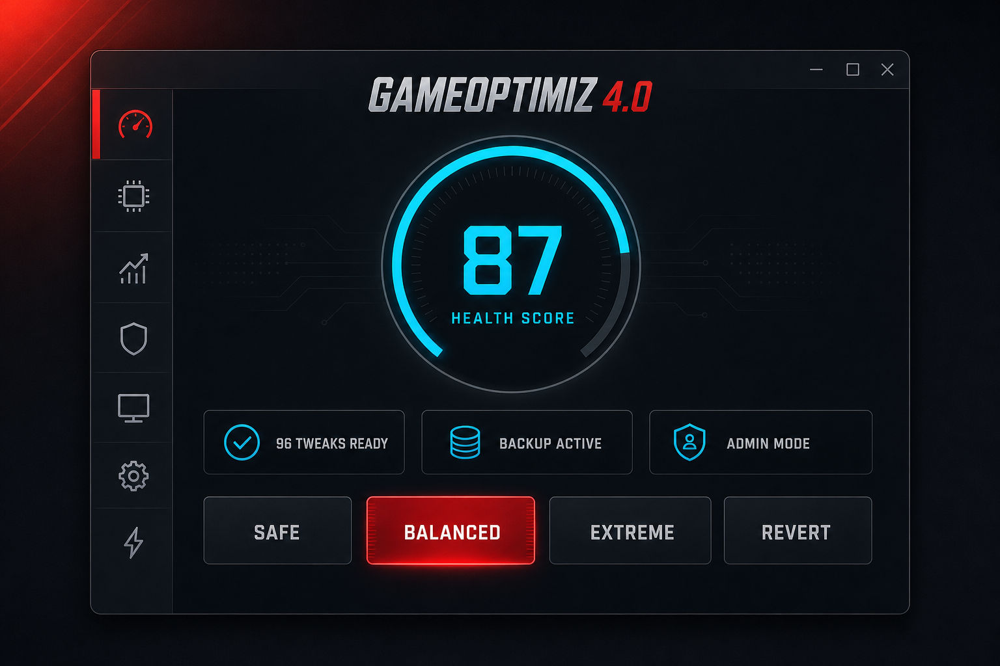

# GAMEOPTIMIZ 4.0

**Optimization by zxcillaura**

[](https://github.com/zxcillaura/GameOptimizer/releases)
[](https://github.com/zxcillaura/GameOptimizer/actions)
[](https://dotnet.microsoft.com/download)
[](https://www.microsoft.com/windows)
[](LICENSE)



Утилита для настройки Windows 10/11 под игровую нагрузку: **96 контролируемых твиков**
с бэкапом и откатом, безопасный очиститель, диагностика железа, HealthScore,
чистый игровой режим и полный CLI. WinForms, .NET 8, x64.

> Линейка: v1.0 → v2.0 → v3.0 (июль 2026) → **v4.0.0** (пересборка, текущая).
> Старые версии сохранены в [`/legacy`](legacy) и в релизах.

---

## Возможности

### Профили (GUI и CLI — один движок)

| Профиль | Что делает |
|---|---|
| **Безопасный** | только твики уровня «безопасно» |
| **Баланс** | безопасные + умеренные — рекомендуемый |
| **Экстрим** | + рискованные (защита, VBS) — только для изолированной игровой машины |
| **Вернуть к заводским** | откат только тех твиков, для которых есть бэкап |

Перед применением — **dry-run (кнопка «ПРЕДПРОСМОТР»)**: сколько действий,
каких уровней риска, где нужна перезагрузка, что пропущено как неприменимое.
Запуск профилей без прав администратора заблокирован — система не остаётся
изменённой наполовину.

### Разделы
- **Главная** — HealthScore (0–100), ТОП-3 ограничителя с кнопкой «Исправить», конфигурация.
- **Профили** — 4 профиля × категории, предпросмотр, лог применения.
- **Центр твиков** — 96 твиков: состояние, риск, бэкап, применить/откатить по одному.
- **Мышь и клава** — input-lag настройки + тест очереди событий.
- **Сеть** — EEE/NIC/MTU/DNS + замер LAN→DNS→интернет **до/после** с вердиктом.
- **Очиститель** — 19 целей, предпросмотр размера, безопасные значения по умолчанию.
- **Игровой режим** — наблюдение за сессией, закрытие оверлеев, purge standby-памяти.

### Безопасность — как устроена
- Каждый твик: свой детектор состояния, свой бэкап (`%LocalAppData%\GAMEOPTIMIZ\backups\tweak-*.json`), свой откат.
- Перед профилем — точка восстановления + снапшот реестра/bcd.
- Очиститель: Prefetch и шейдерный кэш выключены по умолчанию, корзина и
  Windows.old требуют отдельного подтверждения, Service Worker браузеров не трогается.
- Формулировки честные: спорные пункты (HAGS, VBS, питание) не обещают универсальный
  прирост FPS — эффект проверяется своим бенчмарком.

## Скачать

| Версия | Дата | Скачать | Что нового |
|--------|------|---------|-----------|
| **v4.0.0** 🔥 | 09.10.2026 | [⬇️ Release](https://github.com/zxcillaura/GameOptimizer/releases/tag/v4.0.0) | Пересборка: единый движок GUI/CLI, 96 твиков, dry-run, CLI |
| v3.0 | 19.07.2026 | [⬇️ Release](https://github.com/zxcillaura/GameOptimizer/releases/tag/v3.0) · [источник](legacy/v3.0) | Панель диагностики, вкладочный UI |
| v2.0 | 15.07.2026 | [⬇️ Release](https://github.com/zxcillaura/GameOptimizer/releases/tag/v2.0) · [источник](legacy/v2.0) | DNS Jumper, FACEIT/Vanguard |
| v1.0 | 11.07.2026 | [⬇️ Release](https://github.com/zxcillaura/GameOptimizer/releases/tag/v1.0) · [источник](legacy/v1.0) | Первый прототип |

## Сборка

Требования: Windows 10/11 x64, .NET 8 SDK.

```bat
build.bat
```

или вручную:

```powershell
dotnet publish -c Release -r win-x64 --self-contained true `
  -p:PublishSingleFile=true -p:EnableCompressionInSingleFile=true
```

Результат: `bin\Release\net8.0-windows\win-x64\publish\GAMEOPTIMIZ1.0.exe`
(self-contained single-file, ~66 МБ).

## CLI

```text
GAMEOPTIMIZ1.0.exe /scan                  диагностика железа и системы
GAMEOPTIMIZ1.0.exe /doctor                железо + HealthScore + применимость твиков
GAMEOPTIMIZ1.0.exe /report                то же + отчёт в файл
GAMEOPTIMIZ1.0.exe /apply safe|balanced|extreme [--no-restore-point] [--latency]
GAMEOPTIMIZ1.0.exe /revert                откатить профиль (только твики с бэкапом)
GAMEOPTIMIZ1.0.exe /tweaks [фильтр]       все твики: состояние / риск / группа
GAMEOPTIMIZ1.0.exe /tweak <id> on|off|status
GAMEOPTIMIZ1.0.exe /latency on|off|status удержание таймера 0.5 мс
GAMEOPTIMIZ1.0.exe /purge                 очистить standby-список памяти
GAMEOPTIMIZ1.0.exe /backup                точка восстановления + снапшот
GAMEOPTIMIZ1.0.exe /monitor               живые CPU/GPU/RAM/температура + топ процессов
GAMEOPTIMIZ1.0.exe /bench <csv> [игра] [метка]   импорт замера CapFrameX/PresentMon
GAMEOPTIMIZ1.0.exe /session               состояние чистого игрового режима
```

## Структура проекта

```
GameOptimizer.csproj      net8.0-windows, WinForms, self-contained publish
Program.cs                вход: GUI или CLI (аргументы /scan, /doctor, ...)
Cli/                      headless-режим, тот же движок что и GUI
Core/
  Profiles/               ProfileRunner: профили, категории, dry-run
  Tweaks/                 каталог 96 твиков, TweakRunner (бэкап/откат), SystemTweaks
  Backup/                 снапшоты реестра/bcd, точки восстановления
  Hardware/               WMI/PowerShell-сканер железа (RigReport)
  Health/                 HealthScore: оценка 0–100 + ТОП-3 ограничителя
  Cleanup/                DeepCleaner: 19 целей очистки
  Diagnostics/            сетевой тест до/после
  Latency/                таймер 0.5 мс, standby purge
  Games/                  игровой режим (сессии CS2/Dota2)
  Bench/                  импорт и история замеров
UI/                       MainForm + вкладки, кастомные контролы
Utils/                    Reg, ProcessRunner, Toast и прочее
docs/                     превью интерфейса
legacy/                   старые версии v1.0/v2.0/v3.0 (только для истории)
.github/                  CI-сборка (build.yml), шаблоны issues
app.manifest              admin, longPathAware (DPI — PerMonitorV2 через API)
PLAN_1.0_FINAL.md         полное техническое обоснование и статус кода
CHANGELOG.md              полная история версий
WHATSNEW-4.0.txt          changelog текущего релиза
```

## Лицензия

[MIT](LICENSE) — делай что хочешь, но с сохранением авторства.

## Дисклеймер

Утилита меняет реестр, службы, загрузочные параметры и сетевые настройки.
Перед «Экстримом» сделай точку восстановления. Любые изменения (особенно VBS,
bcdedit-флаги, питание USB) проверяй бенчмарком на своём железе — универсальных
гарантий FPS не существует.
