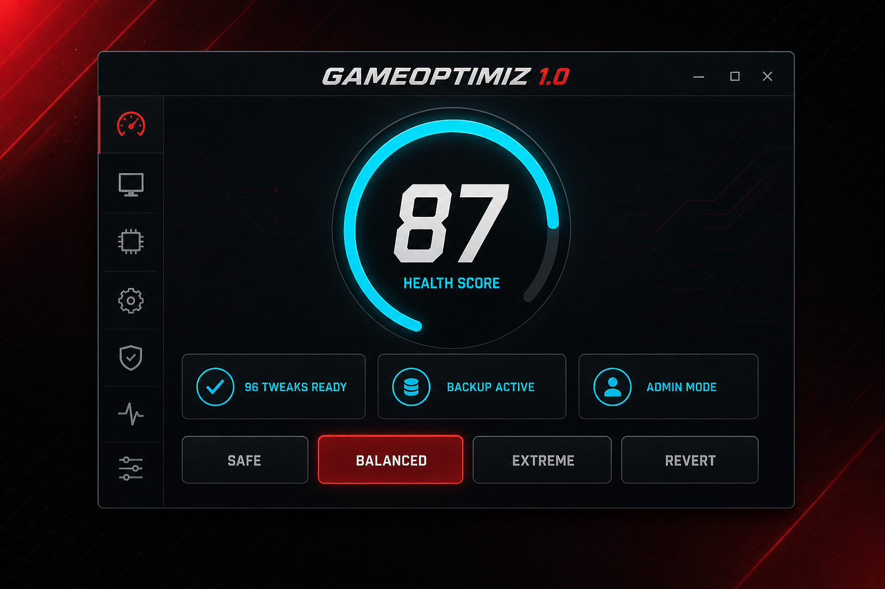

# GAMEOPTIMIZ

> **Windows 10/11 разгоняем без мистики.** 96 твиков. Каждый с бэкапом. Каждая версия с историей.

[](https://github.com/zxcillaura/GameOptimizer/releases/tag/v1.0.0)
[](https://github.com/zxcillaura/GameOptimizer/actions)
[](https://dotnet.microsoft.com/download)
[](https://www.microsoft.com/windows)
[](LICENSE)

<p align="center">
  
</p>

<p align="center"><b>Optimization by zxcillaura</b></p>

---

## 🚀 Что это

**GAMEOPTIMIZ** — утилита, которая наводит порядок в Windows под игру: питание, планировщик,
сеть, мышь/клава, автозагрузка, кэши — всё в одном окне. Без «волшебных» кнопок,
без обещаний «+40 FPS» — только измеримые изменения, которые **в любой момент откатываются**.

| | |
|---|---|
| 🔧 **96 твиков** | каждый со своим детектором, бэкапом и откатом |
| 🛡 **4 профиля** | Безопасный · Баланс · Экстрим · Вернуть к заводским |
| 👁 **Dry-run** | видишь список действий **до** того, как что-то изменится |
| 📊 **HealthScore** | оценка системы 0–100 + ТОП-3 того, что реально ограничивает |
| 🌐 **Сеть** | замер пинга LAN→DNS→интернет **до и после** с вердиктом |
| 🧹 **Очиститель** | 19 целей, предпросмотр размера, безопасные дефолты |
| ⌨️ **Input-lag** | очередь событий мыши/клавиатуры + живой тест |
| 💻 **CLI** | всё, что в GUI, — в терминале: `/doctor`, `/apply`, `/tweaks`… |

## 🎯 Почему GAMEOPTIMIZ

- **Один движок для GUI и CLI** — то, что видит экран, ровно то, что делает терминал.
- **Ничего наполовину** — без прав администратора профиль просто не стартует.
- **Честные формулировки** — где эффект зависит от железа и игры, так и написано.
  Спорные пункты (HAGS, VBS, питание) помечены «проверь бенчмарком».
- **Бэкап у каждого твика** — «Вернуть к заводским» откатывает только то, что меняли мы.
- **История версий** — от первого прототипа 0.1 до стабильного 1.0:
  [полная лестница в релизах](https://github.com/zxcillaura/GameOptimizer/releases).

## ⚡ Разделы

**Главная** — HealthScore, ТОП-3 ограничителя с кнопкой «Исправить», конфигурация.
**Профили** — 4 профиля × категории, предпросмотр, лог применения.
**Центр твиков** — 96 твиков: состояние, риск, бэкап, применить/откатить по одному.
**Мышь и клава** — input-lag настройки + тест очереди событий.
**Сеть** — EEE/NIC/MTU/DNS + замер до/после с вердиктом.
**Очиститель** — 19 целей: temp, кэши, логи, WER, crashdumps… с предпросмотром размера.
**Игровой режим** — сессия CS2/Dota2: оверлеи, standby-память, мониторинг.

## 📦 Скачать

| Версия | Дата | Статус | Скачать |
|--------|------|--------|---------|
| **v1.0.0** | 09.10.2026 | 🔥 **стабильный** | [⬇️ Release](https://github.com/zxcillaura/GameOptimizer/releases/tag/v1.0.0) |
| v0.6.0 | 09.10.2026 | инженерия: CI, MIT, витрина | [Release](https://github.com/zxcillaura/GameOptimizer/releases/tag/v0.6.0) |
| v0.5.0 | 09.10.2026 | документация и структура | [Release](https://github.com/zxcillaura/GameOptimizer/releases/tag/v0.5.0) |
| v0.4.0 | 09.10.2026 | пересборка ядра: движок + 96 твиков | [Release](https://github.com/zxcillaura/GameOptimizer/releases/tag/v0.4.0) |
| v0.3 | 19.07.2026 | legacy: диагностика, вкладки | [Release](https://github.com/zxcillaura/GameOptimizer/releases/tag/v0.3) · [код](legacy/v3.0) |
| v0.2 | 15.07.2026 | legacy: DNS Jumper, FACEIT/VG | [Release](https://github.com/zxcillaura/GameOptimizer/releases/tag/v0.2) · [код](legacy/v2.0) |
| v0.1 | 11.07.2026 | legacy: первый прототип | [Release](https://github.com/zxcillaura/GameOptimizer/releases/tag/v0.1) · [код](legacy/v1.0) |

**Установка:** скачал → запустил **от администратора** → профиль «Баланс» → «ПРЕДПРОСМОТР» → «Применить».
.NET 8 не нужен — exe самодостаточный (~66 МБ).

## 📜 История версий

```
1.0.0  ── стабильный релиз: всё выше + single-file бинарник   ← ты здесь
0.6.0  ── GitHub Actions CI, MIT, issue-шаблоны, hero-превью
0.5.0  ── витрина: README с версиями, /legacy, честные тексты
0.4.0  ── ПЕРЕСБОРКА ЯДРА: единый движок GUI/CLI, 96 твиков,
         HealthScore, dry-run, безопасный очиститель, CLI
0.3    ── (legacy) панель диагностики, вкладочный UI
0.2    ── (legacy) DNS Jumper 30+, диагностика FACEIT/Vanguard
0.1    ── (legacy) первый прототип: питание, ядра, очистка
```

## 🛠 Сборка

Требования: Windows 10/11 x64, .NET 8 SDK.

```bat
build.bat
```

```powershell
dotnet publish -c Release -r win-x64 --self-contained true `
  -p:PublishSingleFile=true -p:EnableCompressionInSingleFile=true
```

Результат: `bin\Release\net8.0-windows\win-x64\publish\GAMEOPTIMIZ1.0.exe` (~66 МБ).

## 💻 CLI

```text
/scan                  диагностика железа и системы
/doctor                железо + HealthScore + применимость твиков
/report                то же + отчёт в файл
/apply safe|balanced|extreme [--no-restore-point] [--latency]
/revert                откатить профиль (только твики с бэкапом)
/tweaks [фильтр]       все твики: состояние / риск / группа
/tweak <id> on|off|status
/latency on|off|status удержание таймера 0.5 мс
/purge                 очистить standby-список памяти
/backup                точка восстановления + снапшот
/monitor               живые CPU/GPU/RAM/температура + топ процессов
/bench <csv> [игра]    импорт замера CapFrameX/PresentMon
/session               состояние чистого игрового режима
```

## 📁 Структура

```
GameOptimizer.csproj      net8.0-windows, WinForms, single-file publish
Program.cs                вход: GUI или CLI
Cli/                      headless-режим, тот же движок что и GUI
Core/
  Profiles/               ProfileRunner: профили, категории, dry-run
  Tweaks/                 каталог 96 твиков, TweakRunner (бэкап/откат)
  Backup/                 снапшоты реестра/bcd, точки восстановления
  Hardware/               сканер железа (RigReport)
  Health/                 HealthScore 0–100 + ТОП-3 ограничителя
  Cleanup/                DeepCleaner: 19 целей
  Diagnostics/            сетевой тест до/после
  Latency/                таймер 0.5 мс, standby purge
  Games/                  игровой режим (CS2/Dota2)
  Bench/                  история замеров
UI/                       MainForm + вкладки, кастомные контролы
Utils/                    Reg, ProcessRunner, Toast
docs/                     превью интерфейса
legacy/                   старая линейка 0.1–0.3 (для истории)
.github/                  CI-сборка, шаблоны issues
```

## 🤝 Вклад

Баг или идея? [Issue-шаблоны](.github/ISSUE_TEMPLATE) уже на месте —
[bugs](https://github.com/zxcillaura/GameOptimizer/issues/new?template=bug_report.md) /
[features](https://github.com/zxcillaura/GameOptimizer/issues/new?template=feature_request.md).

## 📄 Лицензия

[MIT](LICENSE) — делай что хочешь, авторство сохраню :)

## ⚠️ Дисклеймер

Утилита меняет реестр, службы, загрузочные параметры и сетевые настройки.
Перед «Экстримом» — точка восстановления. Любые изменения проверяй бенчмарком
на своём железе: универсальных гарантий FPS не существует, и мы такие не обещаем.
